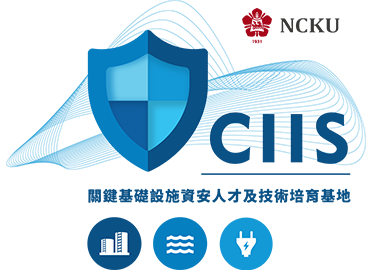

    
    <h1>國立成功大學 關鍵基礎設施資安人才及技術培育基地計畫</h1>

    <a href="https://ciis.cc.ncku.edu.tw/">Official Site</a>｜
    <a href="https://www.facebook.com/people/%E5%9C%8B%E7%AB%8B%E6%88%90%E5%8A%9F%E5%A4%A7%E5%AD%B8-%E9%97%9C%E9%8D%B5%E5%9F%BA%E7%A4%8E%E8%A8%AD%E6%96%BD%E8%B3%87%E5%AE%89%E4%BA%BA%E6%89%8D%E5%8F%8A%E6%8A%80%E8%A1%93%E5%9F%B9%E8%82%B2%E5%9F%BA%E5%9C%B0/100083088914511/">Facebook</a>｜
    <a href="https://www.youtube.com/@NCKUCIIS">YouTube</a>

---

# About

政府「資安即國安」之戰略目的，因應新型態資安威脅，國立成功大學鏈結產官學研資源，提升跨域實務教學能力，攜手數所大專校院、法人單位、國營企業以及民間企業，建置油、水、電等三項關鍵基礎設施教學基地與資安實證場域，共同培育民生能源之資安人才，提升國家關鍵基礎設施資安實戰量能。

